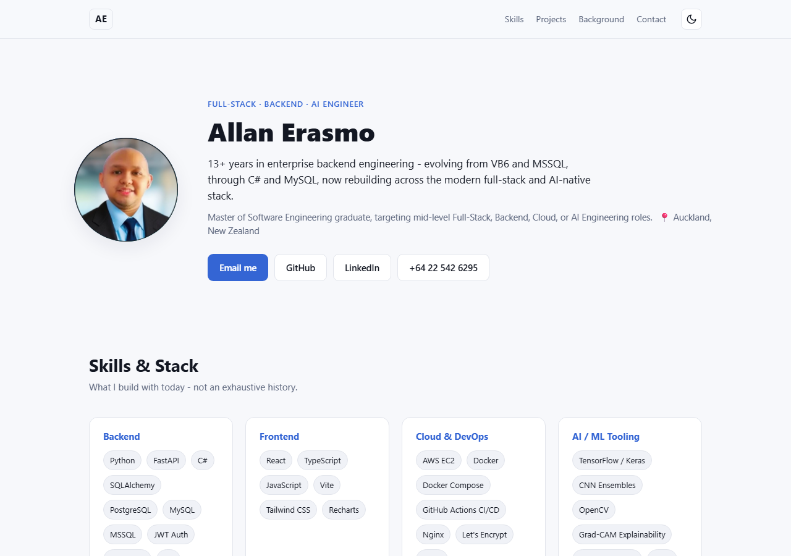
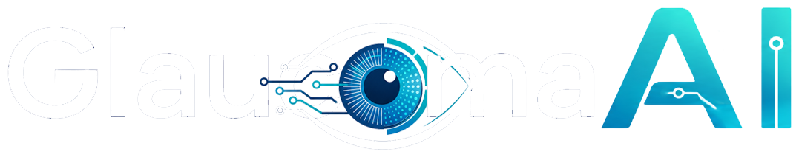

# Portfolio - Allan Erasmo


### A clean, single-page, dependency-free developer portfolio, built to be scanned in under a minute ✨.

View the live site → [aperasmo.github.io/my-portfolio](https://aperasmo.github.io/my-portfolio/)



## Features

- Clean, modern, single-page layout — hero, skills, two featured projects, career background, contact.
- **Zero CSS or JS frameworks** — just hand-written HTML, CSS, and vanilla JavaScript.
- **Self-updating image galleries** — drop numbered screenshots into a folder and they appear on the page automatically, no HTML editing required (see [Adding your photo / screenshots](#adding-your-photo--project-screenshots) below).
- Light / dark theme toggle, respects system preference by default.
- Fully responsive, keyboard-accessible, no build step.
- Loads fast — no bundler, no CDN dependencies, nothing to compile.

## Why no framework?

This is a single page that rarely changes shape. React/Vite/Tailwind would add a build step and a dependency tree for something three files already do well. Keeping it framework-free means anyone can clone it, open `index.html`, and understand the entire codebase in a few minutes.

## Getting Started

You'll need [Git](https://git-scm.com) installed.

```bash
git clone https://github.com/aperasmo/my-portfolio.git
cd my-portfolio
```

No install step. Open `index.html` directly in a browser, or serve it so relative paths behave exactly like production:

```bash
npx serve .
```

## Project structure

```
my-portfolio/
├── index.html                       # all page content lives here
├── css/styles.css                   # theme tokens + layout, no preprocessor
├── js/main.js                       # theme toggle, image auto-loader, lightbox
├── assets/
│   ├── photo/                       # your headshot goes here
│   ├── screenshots/
│   │   ├── glaucoma-ai/             # project 1 screenshots
│   │   └── ai-git-assistant/        # project 2 screenshots
│   └── icons/                       # project logos/icons
└── images/                          # README preview image
```

## Making it your own

Everything lives in `index.html`, grouped into clearly commented `<section>` blocks. Open it and edit the text directly — there's no templating layer to fight.

### Hero

```html
<div class="hero-text">
  <p class="eyebrow">Full-Stack · Backend · AI Engineer</p>
  <h1>Allan Erasmo</h1>
  <p class="hero-tagline">
    13+ years in enterprise backend engineering — evolving from VB6 and MSSQL, through C# and MySQL,
    now rebuilding across the modern full-stack and AI-native stack.
  </p>
  ...
</div>
```

Swap the name, tagline, location, and the four buttons in `.hero-links` (email, GitHub, LinkedIn, phone) for your own.

### Skills & Stack

Each `.skill-group` in `#skills` is a category (`Backend`, `Frontend`, `Cloud & DevOps`, `AI / ML Tooling`). Add or remove `<li>` entries inside the `.tag-list` — the pill styling is automatic:

```html
<div class="skill-group">
  <h3>Backend</h3>
  <ul class="tag-list">
    <li>Python</li><li>FastAPI</li><li>C#</li>
  </ul>
</div>
```

### Featured Projects

Each `.project-card` in `#projects` holds one project: an icon, a title, a live/version badge, and 3–5 bullets in `.project-highlights`:

```html
<article class="project-card" data-accent="glaucoma">
  <div class="project-head">
    
    <div>
      <h3>GlaucomaAI</h3>
      <p class="project-tagline">AI-powered glaucoma pre-screening system — live in production</p>
    </div>
    <span class="badge badge-live">Live</span>
  </div>
  <ul class="project-highlights">
    <li>Your highlight here</li>
  </ul>
  ...
</article>
```

`data-accent="glaucoma"` vs `data-accent="gitassist"` just controls the bullet-dot colour per card — reuse either, or drop the attribute for the default accent colour.

### Background

The `#background` section pairs a 3-node career timeline (`.timeline`) with a narrative paragraph (`.background-copy`) and an optional achievements list reusing the same `.project-highlights` class from the Projects section:

```html
<div class="timeline">
  <div class="timeline-node">
    <span class="timeline-dot"></span>
    <p class="timeline-label">VB6 · MSSQL</p>
    <p class="timeline-sub">Where I started</p>
  </div>
  ...
</div>
```

### Contact

Update the `mailto:`, `tel:`, and social links in `#contact` — same markup pattern as the hero.

## Adding your photo / project screenshots

This is the one genuinely uncommon feature: **you never touch the HTML to add images.** `js/main.js` probes for a fixed set of filenames at load time and silently skips whatever isn't there — so dropping a file into the right folder is the entire workflow.

- Headshot → `assets/photo/photo.jpg` (`.jpeg`/`.png`/`.webp` also work)
- GlaucomaAI screenshots → `assets/screenshots/glaucoma-ai/1.png` … `6.png`
- AI Git Assistant screenshots → `assets/screenshots/ai-git-assistant/1.png` … `6.png`

No file present → the section falls back gracefully (initials avatar for the photo, no gallery block for screenshots). Screenshots that are present render as a clickable gallery with a built-in lightbox. See each folder's `HOW_TO_ADD.md` for details.

## Deploying to GitHub Pages

```bash
git init
git add .
git commit -m "Initial portfolio"
git branch -M main
git remote add origin https://github.com/<your-username>/<repo-name>.git
git push -u origin main
```

Then in the repo: **Settings → Pages → Source → Deploy from branch → `main` / `(root)`**. Name the repo `<your-username>.github.io` for a root-level URL, or anything else for `https://<your-username>.github.io/<repo-name>/` — all asset paths in this project are relative, so both work with no changes.

## Content sourcing

The project bullets in `#projects` are pulled directly from the two source repos' code, configs, and metrics files, not invented — see `docker-compose.yml`, `backend/metrics/evaluation_results.json`, and `package.json`/`Cargo.toml` in each respective project for the underlying facts.

---

Feel free to fork this as a starting point for your own portfolio — swap the content, keep the structure.
